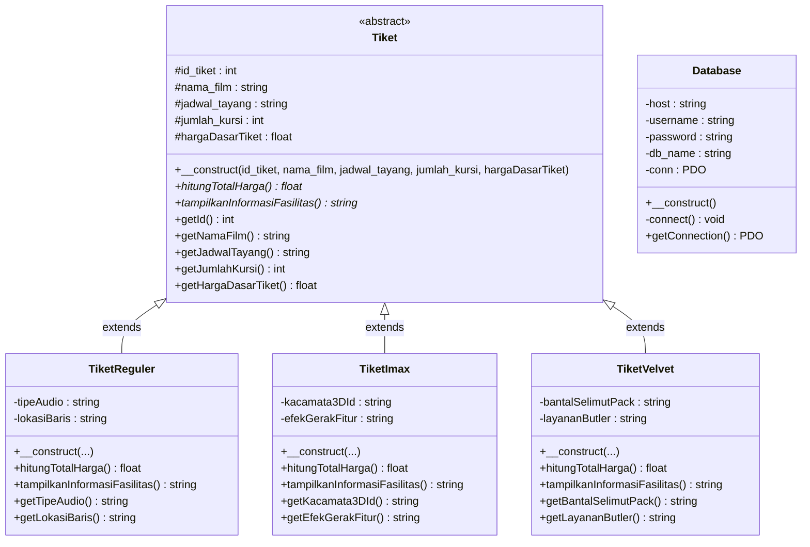
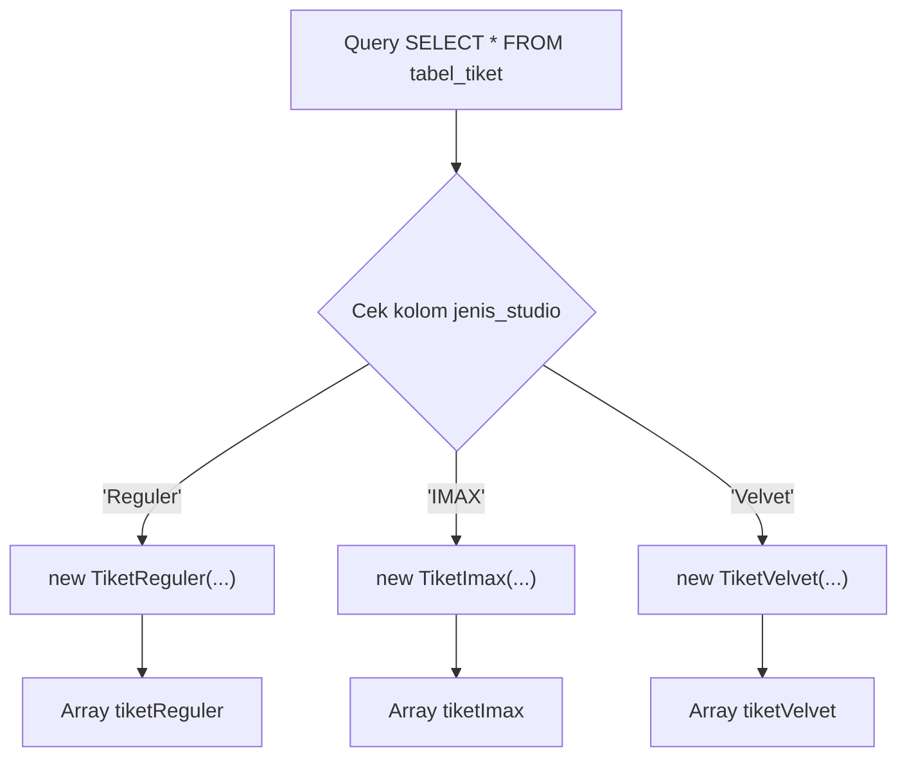
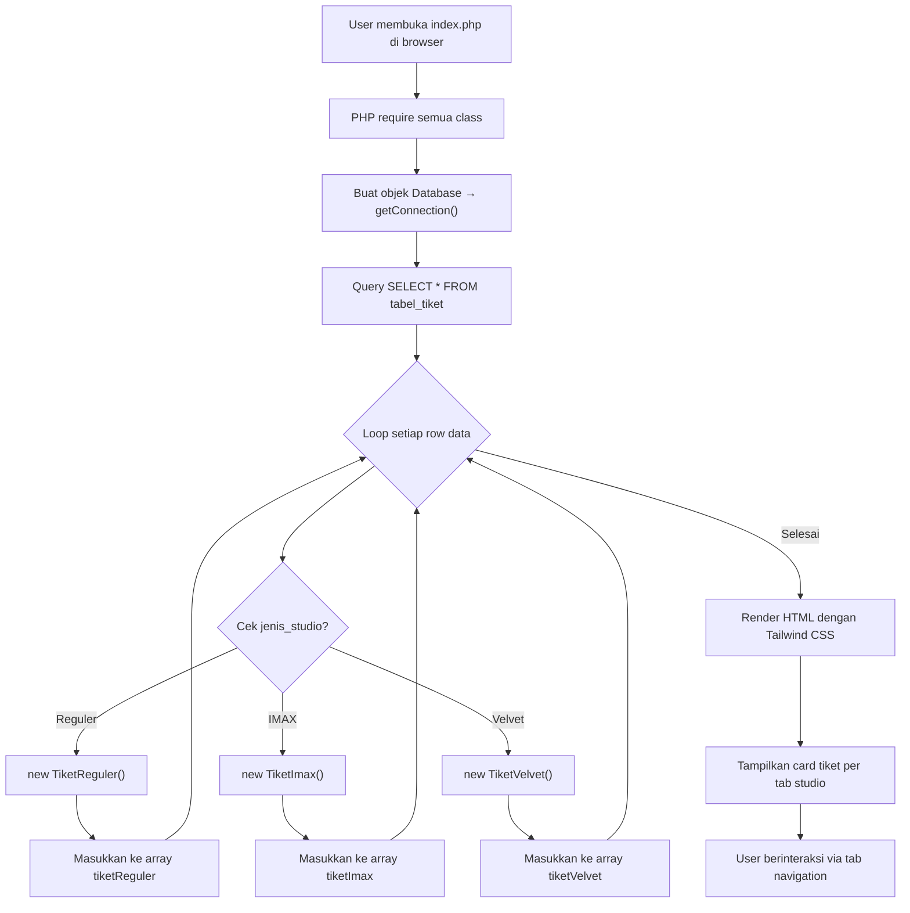

# 📋 Penjelasan Sistem Informasi Tiket Bioskop

**Mata Kuliah:** Pemrograman Berorientasi Objek (PBO)
**Kelas:** TRPL 1A
**Nama:** Rifki Pramudya Pangestu
**Teknologi:** PHP OOP, PDO MySQL, Tailwind CSS

---

## 1. Gambaran Umum Sistem

Sistem ini merupakan **Sistem Informasi Tiket Bioskop** berbasis web yang menampilkan data tiket dari database secara dinamis. Sistem ini dibangun menggunakan paradigma **Pemrograman Berorientasi Objek (OOP)** dengan bahasa PHP, dan mengimplementasikan **4 pilar utama PBO**:

| Pilar PBO                   | Penerapan dalam Sistem                                                                                  |
| --------------------------- | ------------------------------------------------------------------------------------------------------- |
| **Abstraksi**               | Abstract class `Tiket` sebagai blueprint yang tidak bisa diinstansiasi langsung                         |
| **Enkapsulasi**             | Properti `protected`/`private` dengan getter method untuk akses terkontrol                              |
| **Pewarisan (Inheritance)** | 3 child class (`TiketReguler`, `TiketImax`, `TiketVelvet`) mewarisi `Tiket`                             |
| **Polimorfisme**            | Method `hitungTotalHarga()` dan `tampilkanInformasiFasilitas()` di-override berbeda di tiap child class |

---

## 2. Struktur File Proyek

```
Latihan_PBO_RifkiPramudyaP/
├── koneksi/
│   └── database.php                          ← Class Database (koneksi PDO)
├── Tiket.php                                 ← Abstract class Tiket (parent)
├── TiketReguler.php                          ← Child class untuk studio Reguler
├── TiketImax.php                             ← Child class untuk studio IMAX
├── TiketVelvet.php                           ← Child class untuk studio Velvet
├── index.php                                 ← Halaman utama (View + Controller)
└── db_latihan_pbo_trpl1a_rifki_...sql        ← File SQL untuk import database
```

---

## 3. Diagram Class (UML)



> **Keterangan simbol:**
> `#` = protected, `-` = private, `+` = public, `*` = abstract method

---

## 4. Penjelasan Tiap File

### 4.1. [database.php](file:///d:/Tugas%20Kuliah%20SMT%202/PBO/Latihan_PBO_RifkiPramudyaP/koneksi/database.php) — Class Koneksi Database

**Konsep PBO:** Enkapsulasi

Class `Database` membungkus seluruh konfigurasi dan logika koneksi ke database MySQL menggunakan PDO. Detail koneksi (host, username, password, db_name) disimpan sebagai properti **private**, sehingga tidak bisa diakses atau dimodifikasi dari luar class.

```
Database
├── Properti private: host, username, password, db_name, conn
├── Constructor: otomatis memanggil method connect() saat objek dibuat
├── connect() [private]: membuat koneksi PDO ke MySQL
└── getConnection() [public]: satu-satunya cara akses koneksi dari luar
```

> [!IMPORTANT]
> Penggunaan `private` pada properti koneksi merupakan implementasi **Enkapsulasi** — melindungi data sensitif (credential database) agar tidak bisa diakses langsung dari luar class.

---

### 4.2. [Tiket.php](file:///d:/Tugas%20Kuliah%20SMT%202/PBO/Latihan_PBO_RifkiPramudyaP/Tiket.php) — Abstract Class Tiket (Parent Class)

**Konsep PBO:** Abstraksi + Enkapsulasi

Class `Tiket` dideklarasikan sebagai **abstract**, artinya:

- ❌ **Tidak bisa** dibuat objeknya secara langsung (`new Tiket()` akan error)
- ✅ Berfungsi sebagai **blueprint/kerangka dasar** bagi class turunannya

#### Properti (protected):

| Properti           | Tipe   | Keterangan                |
| ------------------ | ------ | ------------------------- |
| `$id_tiket`        | int    | ID unik tiket             |
| `$nama_film`       | string | Nama film yang ditonton   |
| `$jadwal_tayang`   | string | Jadwal penayangan         |
| `$jumlah_kursi`    | int    | Jumlah kursi yang dipesan |
| `$hargaDasarTiket` | float  | Harga dasar per tiket     |

#### Abstract Method (wajib diimplementasikan oleh child class):

| Method                          | Fungsi                                                         |
| ------------------------------- | -------------------------------------------------------------- |
| `hitungTotalHarga()`            | Menghitung total harga tiket (rumus berbeda tiap jenis studio) |
| `tampilkanInformasiFasilitas()` | Menampilkan informasi fasilitas spesifik studio                |

#### Getter Method:

`getId()`, `getNamaFilm()`, `getJadwalTayang()`, `getJumlahKursi()`, `getHargaDasarTiket()` — menyediakan akses **read-only** ke properti protected dari luar class.

---

### 4.3. [TiketReguler.php](file:///d:/Tugas%20Kuliah%20SMT%202/PBO/Latihan_PBO_RifkiPramudyaP/TiketReguler.php) — Class Studio Reguler

**Konsep PBO:** Inheritance + Polimorfisme + Enkapsulasi

#### Properti Tambahan (private):

| Properti       | Tipe   | Keterangan                            | Kolom DB       |
| -------------- | ------ | ------------------------------------- | -------------- |
| `$tipeAudio`   | string | Jenis sistem audio (misal: Dolby 7.1) | `tipe_audio`   |
| `$lokasiBaris` | string | Posisi baris kursi (misal: Row G)     | `lokasi_baris` |

#### Implementasi `hitungTotalHarga()`:

```
Total Harga = jumlah_kursi × hargaDasarTiket
```

Studio Reguler menggunakan **tarif standar murni** tanpa biaya tambahan.

**Contoh:** 50 kursi × Rp 45.000 = **Rp 2.250.000**

---

### 4.4. [TiketImax.php](file:///d:/Tugas%20Kuliah%20SMT%202/PBO/Latihan_PBO_RifkiPramudyaP/TiketImax.php) — Class Studio IMAX

**Konsep PBO:** Inheritance + Polimorfisme + Enkapsulasi

#### Properti Tambahan (private):

| Properti          | Tipe   | Keterangan                           | Kolom DB           |
| ----------------- | ------ | ------------------------------------ | ------------------ |
| `$kacamata3DId`   | string | ID kacamata 3D yang dipinjamkan      | `kacamata_3D_id`   |
| `$efekGerakFitur` | string | Fitur efek gerak kursi (motion seat) | `efek_gerak_fitur` |

#### Implementasi `hitungTotalHarga()`:

```
Total Harga = (jumlah_kursi × hargaDasarTiket) + Rp 35.000
```

Studio IMAX dikenakan **biaya tambahan flat Rp 35.000** untuk teknologi proyeksi layar lebar IMAX dan audio immersive.

**Contoh:** (120 kursi × Rp 75.000) + Rp 35.000 = **Rp 9.035.000**

---

### 4.5. [TiketVelvet.php](file:///d:/Tugas%20Kuliah%20SMT%202/PBO/Latihan_PBO_RifkiPramudyaP/TiketVelvet.php) — Class Studio Velvet (Premium/VIP)

**Konsep PBO:** Inheritance + Polimorfisme + Enkapsulasi

#### Properti Tambahan (private):

| Properti             | Tipe   | Keterangan                     | Kolom DB              |
| -------------------- | ------ | ------------------------------ | --------------------- |
| `$bantalSelimutPack` | string | Paket bantal & selimut premium | `bantal_selimut_pack` |
| `$layananButler`     | string | Layanan butler pribadi         | `layanan_butler`      |

#### Implementasi `hitungTotalHarga()`:

```
Total Harga = (jumlah_kursi × hargaDasarTiket) × 1.50
```

Studio Velvet dikenakan **surcharge/biaya tambahan premium sebesar 50%** dari total harga dasar.

**Contoh:** (20 kursi × Rp 150.000) × 1.50 = **Rp 4.500.000**

---

### 4.6. [index.php](file:///d:/Tugas%20Kuliah%20SMT%202/PBO/Latihan_PBO_RifkiPramudyaP/index.php) — Halaman Utama (View + Controller)

File ini berfungsi sebagai **halaman utama** yang menggabungkan logika PHP (controller) dan tampilan HTML (view):

#### Bagian PHP (Controller):

1. **Require file class** — Meng-include semua class yang dibutuhkan
2. **Koneksi database** — Membuat objek `Database` dan mengambil koneksi PDO
3. **Fetch & instansiasi** — Mengambil data dari `tabel_tiket` dan membuat objek sesuai `jenis_studio`:



> [!TIP]
> **Ini adalah inti Polimorfisme!** Berdasarkan data di database, objek dari class yang berbeda dibuat. Ketika method yang sama (`hitungTotalHarga()`) dipanggil, hasilnya berbeda sesuai implementasi masing-masing child class.

#### Bagian HTML (View):

- **Header/Hero**: Menampilkan judul sistem dan statistik jumlah tiket per studio
- **Tab Navigation**: 3 tombol tab (Reguler, IMAX, Velvet) dengan JavaScript switching
- **Card Grid**: Menampilkan tiket dalam card responsif dengan:
  - Header card: badge jenis studio, ID tiket, nama film
  - Body card: jadwal, jumlah kursi, fasilitas spesifik
  - Footer card: total harga (hasil `hitungTotalHarga()`)
  - Detail fasilitas: output `tampilkanInformasiFasilitas()` dalam format expandable
- **Footer**: Copyright dan info teknologi yang digunakan

---

## 5. Skema Database

**Database:** `db_latihan_pbo_trpl1a_rifki pramudya pangestu`
**Tabel:** `tabel_tiket`

| Kolom                 | Tipe Data                       | Keterangan            |
| --------------------- | ------------------------------- | --------------------- |
| `id_tiket`            | INT (PK, AUTO_INCREMENT)        | ID unik tiket         |
| `nama_film`           | VARCHAR(255)                    | Nama film             |
| `jadwal_tayang`       | DATETIME                        | Jadwal penayangan     |
| `jumlah_kursi`        | INT                             | Jumlah kursi          |
| `harga_dasar_tiket`   | DECIMAL(10,2)                   | Harga dasar per tiket |
| `jenis_studio`        | ENUM('Reguler','IMAX','Velvet') | Jenis studio          |
| `tipe_audio`          | VARCHAR(50), NULL               | _Khusus Reguler_      |
| `lokasi_baris`        | VARCHAR(5), NULL                | _Khusus Reguler_      |
| `kacamata_3D_id`      | VARCHAR(50), NULL               | _Khusus IMAX_         |
| `efek_gerak_fitur`    | VARCHAR(100), NULL              | _Khusus IMAX_         |
| `bantal_selimut_pack` | VARCHAR(50), NULL               | _Khusus Velvet_       |
| `layanan_butler`      | VARCHAR(100), NULL              | _Khusus Velvet_       |

> [!NOTE]
> Tabel menggunakan pola **Single Table Inheritance** — semua jenis tiket disimpan dalam satu tabel, dengan kolom-kolom spesifik bernilai NULL untuk jenis studio yang tidak relevan. Total data sample: **20 record** (9 Reguler, 6 IMAX, 5 Velvet).

---

## 6. Alur Kerja Sistem (Flowchart)



---

## 7. Ringkasan Implementasi 4 Pilar PBO

### 🔵 Abstraksi

- Class `Tiket` dideklarasikan `abstract` → tidak bisa diinstansiasi langsung
- Method `hitungTotalHarga()` dan `tampilkanInformasiFasilitas()` dideklarasikan `abstract` → memaksa child class untuk mengimplementasikan

### 🟢 Enkapsulasi

- **Class Database**: Properti koneksi bersifat `private`, akses hanya melalui `getConnection()`
- **Class Tiket**: Properti dasar bersifat `protected`, akses melalui getter methods
- **Child Classes**: Properti tambahan bersifat `private`, masing-masing punya getter sendiri

### 🟡 Pewarisan (Inheritance)

- `TiketReguler extends Tiket`
- `TiketImax extends Tiket`
- `TiketVelvet extends Tiket`
- Semua child class memanggil `parent::__construct()` untuk inisialisasi properti warisan

### 🔴 Polimorfisme (Method Overriding)

Method yang sama, implementasi berbeda:

| Method                          | TiketReguler       | TiketImax                     | TiketVelvet                  |
| ------------------------------- | ------------------ | ----------------------------- | ---------------------------- |
| `hitungTotalHarga()`            | `kursi × harga`    | `(kursi × harga) + 35.000`    | `(kursi × harga) × 1.50`     |
| `tampilkanInformasiFasilitas()` | Info audio & baris | Info kacamata 3D & efek gerak | Info bantal/selimut & butler |

---

## 8. Teknologi yang Digunakan

| Teknologi                  | Kegunaan                                              |
| -------------------------- | ----------------------------------------------------- |
| **PHP 8.x**                | Bahasa pemrograman utama (OOP)                        |
| **PDO (PHP Data Objects)** | Koneksi database yang aman dengan prepared statements |
| **MySQL 8.0**              | Database server                                       |
| **Tailwind CSS (CDN)**     | Framework CSS untuk styling modern dan responsif      |
| **Google Fonts (Inter)**   | Tipografi modern                                      |
| **JavaScript**             | Tab navigation interaktif                             |
| **HTML5**                  | Struktur halaman semantik                             |
